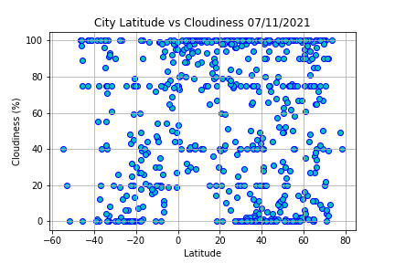

# python-api-challenge
## What's the Weather Like?

To answer the question "What's the weather like as we approach the equator?" this project randomly selected 500+ cities across the world to create a representative model of the weather. The analysis was performed in two parts in this project.  

## Part I - WeatherPy

The Pyhton library *citipy* and  the *OpenWeatherMap API* was used to accomplish visualization of the weather model across cities in the world.
The following series of scatter plots was built to showcase the relationship between the cities' latitude, temperature, humidity, cloudiness and wind speed.

Then linear regression was performed on each relationship, in two sets of cities separated by latitude, in the Northern Hemisphere set (latitude greater than or equal to 0 degrees) and the Southern Hemisphere set (latitude less than 0 degrees). For each set of cities the pair of plots of linear regression was built to showcase the relationship (if any).

- Temperature (F) vs. Latitude

There is a relationship between latitude and maximum temperature. When the latitude decreases (location closer to equator) the temperature increases, when the latitude increases( locations closer to earth poles) temperature decreases. There are some scattered values in the plot. With the results showen we should also consider that there might be other factors influencing the temperature (ocean currents, precipitation, altitude etc.)  

- Humidity (%) vs. Latitude

We can observe that there is no correlation between latitude and humidity based on the dataset.There is a significant scatter in humidity values vs latitude across the plot.  

- Cloudiness (%) vs. Latitude

Based on the plot Latitude vs  Cloudiness in 597 cities from the dataset we cannot observe any relationship between the two values considered. The values for cloudiness are scattered across a whole range of latitudes' values.
- Wind Speed (mph) vs. Latitude

There is no relationship between wind speed and latitude based on the scatter plot. Most cities are located in an area where the wind speed reaches up to 10mph, with a few outliers where wind speed reaches over 35 mph.

Linear regression
- Northern Hemisphere - Temperature (F) vs. Latitude

- Southern Hemisphere - Temperature (F) vs. Latitude

The linear regression analysis for  Northern Hemisphere data set vs Temperature and Southern Hemisphere vs Temperature supports linear relationship between temperature and latitude. There is a moderate to stronger linear relationship based on the values of r. For the Northern Hemisphere there is a moderate negative linear relationship, and based on the line equation approximately 40% of the variation in temperature is explained by latitude (r = 0.3978). When latitude increases, the temperature decreases  - for location further from the equator the temperature in world cities decreases. The value of slope is negative 0.46, with intercept 89.78. For Southern Hemisphere the linear relationship is stronger - with r value 0.62, and positive slope value 0.75 there is a positive linear relationship between temperature and latitude. For location closer to the equator (latitude equals zero), temperature increases. With intercept value 78.66, on the equator the temperature is 78.66  for this dataset. 

- Northern Hemisphere - Humidity (%) vs. Latitude

- Southern Hemisphere - Humidity (%) vs. Latitude

In both plots for Northern Hemisphere vs Humidity and Southern Hemisphere vs Humidity we calculated the line equation which resulted in a weak linear relationship between humidity and latitude, the same result as in the combined set of data analyzed previously. But there is a slight difference between the Northern and Southern Hemisphere equation line results. Based on that we can say there is a weak negative linear relationship in data for the Northern set - when latitude increases, the humidity decreases, or with distance further from the equator there is less humid weather. Value of r is 0.006, with intercept 75.02 and negative slope 0.09. That means that only 0.6% of the variation in humidity can be explained by latitude. 
For Southern Hemisphere data set there is a weak positive linear relationship, with value of r 0.027, and intercept 78.49, with positive slope 0.24.  In this weak linear relationship we can explain approximately 2.7 % of variantion in humidity by latitude. When latitude increases, the humidity increasees, too. For locations closer to the equator the humidity is greater. In both sets the intercept was around 75 -78 (for Northern Hem 75.02;for Southern Hem 78.49). This means on the equator (for latitude equals zero), the humidity values are around 75 - 78 %.  

- Northern Hemisphere - Cloudiness (%) vs. Latitude

- Southern Hemisphere - Cloudiness (%) vs. Latitude

Linear regression model for Northern Hemisphere  and Southern Hemisphere Cloudiness vs Latitude shows only a weak linear relationship. 
Value of r  is 0.0229 for the Northern set of cities, with slope value equal to negative 0.29. By that we can say that approximately 2%  of the variation in cloudiness is explained by latitude. It is a negative weak linear correlation – when latitude (as an independent variable) increases, the cloudiness decreases.
For the world cities in set for the Southern Hemisphere r-value is 0.00056. With this value close to zero, there is almost no linear correlation between the cloudiness and latitude. In the line equation the slope has a value + 0.06, which is a weak positive linear correlation in the data (when latitude increases, the cloudiness increases). 

- Northern Hemisphere - Wind Speed (mph) vs. Latitude

- Southern Hemisphere - Wind Speed (mph) vs. Latitude

In plots for linear regression with the line equation for Northern Hemisphere Wind Speed vs Latitude and Southern Hemisphere Wind Speed vs Latitude there was no proven linear relationship between wind speed and latitude. Values of r in both cases are  close or equal to zero.
For Northern Hemisphere  the r – value in the line equation is zero, with an intercept value 7.1 , which means that there is no linear relationship between wind speed and latitude . In the real world the interpretation of the intercept doesn’t make sense, but it is acceptable as a coefficient. In this case, if wind speed is zero, the latitude is approximately 7 degrees.  
For Southern Hemisphere the line equation shows a negative linear relationship – when the latitude decreases, wind speed increases. R value is 0.09, with the value for slope -0.15. It means that approximately 9% of the variation in wind speed is explained by latitude. The relationship between wind speed and latitude by r-value is considered weak. On the plot there are more higher values for the wind speed found around negative 40 degrees, which is most likely caused by other factors (wind currents across the globe around 40 degrees south from the equator,with no evident continental mass etc).

## Part II - VacationPy

With the weather data analyzed in this part we use it to plan someone's future vacation. Google places API and jupyter gmaps were use to show final destination for vacation with predefined ideal weather conditions to choose the places to stay in a nearby accomodation chosen.
- **Heatmap for world cities from Part I**

The heatmap showcases humidity for each city in the dataset from the Part I. To find an ideal place to stay the weather conditions are narrowed down to places which have:
    * max temperature of more than 77 degrees and less than 86 degrees
    * cloudiness less than 10%
    * wind speed less than 10 mph

Then using Google Places API the first hotel was found for each city located within 5000 meters of the city coordinates. On the top of the humidity heatmap for each hotel a pin was created with the following information: **Hotel Name**, **City**, and **Country**.  

- **Heat map with places with ideal weather conditions and nearby accomodations**

